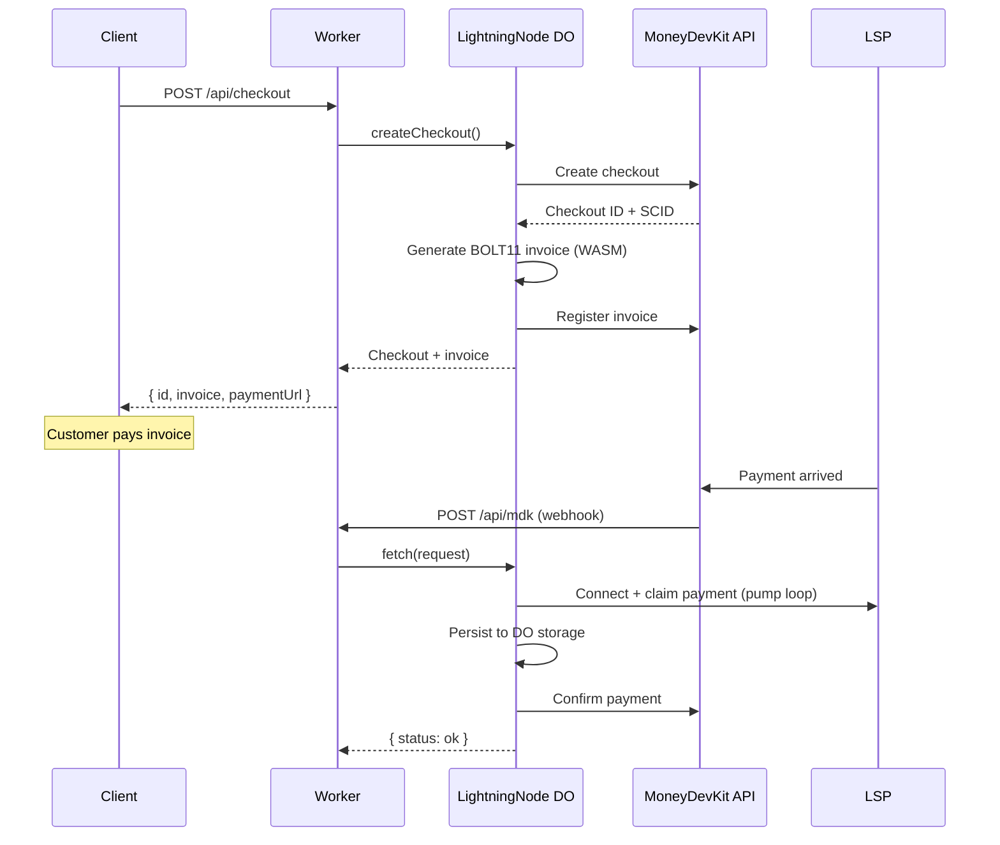
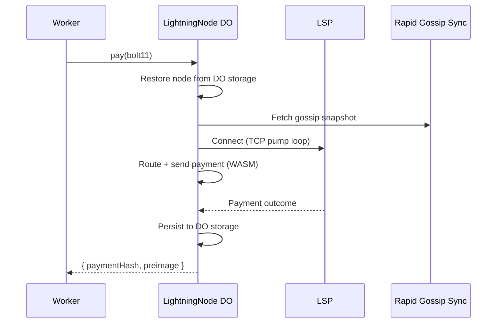

# mdk-cloudflare

Cloudflare Workers backend for Lightning payments and MoneyDevKit checkout flows via a [Durable Object](https://developers.cloudflare.com/durable-objects/).

Published package:

- `mdk-cloudflare` for the Worker and Durable Object backend

Pair it with:

- `@moneydevkit/core` for the official checkout page React components and hooks

Current public support: `mainnet` only.

Docs:

- Architecture: [ARCHITECTURE.md](ARCHITECTURE.md)
- Checkout page setup: [CHECKOUT_PAGE_SETUP.md](CHECKOUT_PAGE_SETUP.md)
- LLM integration guide: [llms.txt](llms.txt)
- Package docs: [packages/lightning-cloudflare/README.md](packages/lightning-cloudflare/README.md)

## Packages

| Package | Install | Use when |
|---|---|---|
| `mdk-cloudflare` | `npm install mdk-cloudflare` | You want the Worker + Durable Object backend on Cloudflare |
| Upstream React UI | `npm install @moneydevkit/core react react-dom` | You want the official MoneyDevKit checkout page UI in a React app |

## Repo Layout

- `packages/lightning-cloudflare/` — Worker backend and Durable Object package
- `crates/ldk-wasm/` — Rust LDK core compiled to WASM
- `examples/basic-worker/` — backend-only Worker reference
- `examples/react-vite-worker/` — minimal React + Vite app using `@moneydevkit/core/client`
- `examples/react-router-worker/` — React Router app using `@moneydevkit/core/client`

## Choose Your Path

- Backend only
  Install `mdk-cloudflare` and copy the Worker shape from `examples/basic-worker/`.
- New React checkout page app
  Install `mdk-cloudflare` and `@moneydevkit/core`, then use the closest React example.
- Existing Vite React or React Router app
  Keep your current app structure, add the `/api/mdk` Worker route, then mount the official MoneyDevKit React checkout UI under your existing frontend.
- Agent-assisted integration
  Point your coding agent at `llms.txt`, `CHECKOUT_PAGE_SETUP.md`, and the closest example.

## Backend Quick Start

**wrangler.toml:**

```toml
compatibility_date = "2025-01-01"
compatibility_flags = ["nodejs_compat"]

[[durable_objects.bindings]]
name = "LIGHTNING_NODE"
class_name = "LightningNode"

[[migrations]]
tag = "v1"
new_sqlite_classes = ["LightningNode"]
```

> **Important:** You must use `new_sqlite_classes`, not `new_classes`. The Durable Object uses SQLite-backed storage.

**worker.ts:**

```ts
import { LightningNode, createUnifiedHandler } from 'mdk-cloudflare'

// Required: re-export the DO class so the CF runtime can instantiate it
export { LightningNode }

interface Env {
  LIGHTNING_NODE: DurableObjectNamespace<LightningNode>
  MDK_ACCESS_TOKEN: string
}

export default {
  async fetch(request: Request, env: Env): Promise<Response> {
    const node = env.LIGHTNING_NODE.get(env.LIGHTNING_NODE.idFromName('default'))

    // Unified route for browser/API/webhook traffic
    if (new URL(request.url).pathname === '/api/mdk') {
      return createUnifiedHandler({
        node,
        accessToken: env.MDK_ACCESS_TOKEN,
      })(request)
    }

    // Create a checkout
    const checkout = await node.createCheckout({ amount: 1000, currency: 'SAT' })
    return Response.json(checkout)
  },
}
```

**Secrets:**

```bash
wrangler secret put MNEMONIC          # BIP-39 mnemonic (generates your node's keys)
wrangler secret put MDK_ACCESS_TOKEN  # from moneydevkit.com
```

For local development with `wrangler dev`, use a `.dev.vars` file next to `wrangler.toml`.

Examples:

- [`examples/basic-worker/`](examples/basic-worker/) — backend-only Worker reference
- [`examples/react-vite-worker/`](examples/react-vite-worker/) — checkout pages with a minimal React + Vite SPA shell
- [`examples/react-router-worker/`](examples/react-router-worker/) — checkout pages mounted into a React Router app

If you want the checkout page UI, install `@moneydevkit/core` and follow [`CHECKOUT_PAGE_SETUP.md`](CHECKOUT_PAGE_SETUP.md).

The current public release supports only `mainnet`. Signet/testnet flows are not
documented or supported.

## API

All methods are called via [DO RPC](https://developers.cloudflare.com/durable-objects/best-practices/create-durable-object-stubs-and-send-requests/#calling-rpc-methods) on the Durable Object stub.

### Checkouts

```ts
// Create checkout (MDK API + invoice generation + LSP registration)
const checkout = await node.createCheckout({
  amount: 2500,
  currency: 'USD',         // or 'SAT'
  metadata: { orderId: '123' },
  successUrl: '/thank-you',
})
// Returns: { id, status, invoice, paymentHash, paymentUrl, invoiceAmountSats, invoiceScid }

// Poll checkout status
const status = await node.getCheckout(checkout.id)
```

### Payments

```ts
// Send an outbound BOLT11 payment
const result = await node.pay('lnbc10u1p...')
// Returns: { paymentId, paymentHash, preimage }
```

### Node Info

```ts
const nodeId = await node.getNodeId()

const info = await node.getNodeInfo()
// Returns: { balanceSats, channels: [{ channelId, inboundCapacityMsat, outboundCapacityMsat, isUsable, ... }] }

const debug = await node.debug()
// Returns: { node, config, chain, nodeInfo, channels }
```

### Webhooks

The built-in `/api/mdk` route processes MDK server callbacks when you wire it through `createUnifiedHandler()`:

```ts
if (url.pathname === '/api/mdk') {
  return createUnifiedHandler({
    node,
    accessToken: env.MDK_ACCESS_TOKEN,
  })(request)
}
```

MDK servers call this endpoint when a payment arrives. The DO connects to the LSP, claims the payment, and confirms it with MDK.

### LNURL Utilities

```ts
import { resolveDestinationToInvoice, parseBolt11AmountMsat } from 'mdk-cloudflare'

// Resolve Lightning Address or LNURL to a BOLT11 invoice
const bolt11 = await resolveDestinationToInvoice('user@example.com', 10000)

// Parse amount from a BOLT11 invoice
const msat = parseBolt11AmountMsat('lnbc10u1p...')
```

### Logging

```ts
import { setLogLevel } from 'mdk-cloudflare'

setLogLevel('debug') // 'debug' | 'info' | 'warn' | 'error' | 'none'
```

Defaults to `'info'`. Set to `'debug'` for verbose pump loop and fetch tracing.

## Configuration

| Env Variable | Required | Description |
|---|---|---|
| `MNEMONIC` | Yes | BIP-39 mnemonic (secret) |
| `MDK_ACCESS_TOKEN` | Yes | MDK API key (secret) |
| `NETWORK` | No | `"mainnet"` only. Leave unset or set to `"mainnet"`. Any other value is rejected. |

`/api/mdk` uses `MDK_ACCESS_TOKEN` for secret-authenticated MDK server requests. If you later add MoneyDevKit Standard Webhooks for app-level events such as `checkout.completed`, use a separate endpoint like `/api/webhooks/mdk` and verify its `whsec_...` signing secret independently.

## How It Works

The `LightningNode` Durable Object runs an ephemeral [LDK](https://lightningdevkit.org/) node compiled to WASM. On each operation:

1. Node state (channel monitors, channel manager) is restored from DO storage
2. The node connects to the LSP, processes events, and executes the operation
3. Updated state is persisted back to DO storage with `sync()` for durability

The DO provides single-threaded serialization — only one operation runs at a time, preventing concurrent state corruption. A periodic alarm handles fee cache refresh, chain sync, and transaction rebroadcast in the background.

For the full runtime model and path-by-path breakdown, see [ARCHITECTURE.md](ARCHITECTURE.md).

### Checkout Flow



### Payment Flow



## Prerequisites

- [Node.js](https://nodejs.org/) >= 18
- [pnpm](https://pnpm.io/) (for monorepo development)
- [Rust](https://rustup.rs/) (for building WASM)
- [wasm-pack](https://rustwasm.github.io/wasm-pack/installer/)
- [Wrangler](https://developers.cloudflare.com/workers/wrangler/install-and-update/) with a logged-in Cloudflare account
- A [MoneyDevKit](https://moneydevkit.com/) account for `MDK_ACCESS_TOKEN`

## Development

```bash
pnpm install
pnpm build          # Full build (WASM + TypeScript)
pnpm build:wasm     # WASM only
pnpm build:packages # TypeScript only
pnpm check          # Quick Rust compile check
pnpm pack:check     # Verify the published npm tarball contents

# Run TypeScript tests
pnpm test:ts

# Run Rust WASM tests
pnpm test:wasm
```

## Architecture

```
Your Worker (thin HTTP router)
  → LightningNode Durable Object (mdk-cloudflare)
    → DO SQLite storage (channel monitors, channel manager, fee cache)
    → MdkNode (WASM orchestration, pump loop)
      → ldk-wasm (Rust/WASM)
        → LDK (Lightning Development Kit)
          → Esplora (chain data) + LSP (liquidity) via CF fetch/connect
    → MoneyDevKit API (checkout management)
```

See [`ARCHITECTURE.md`](ARCHITECTURE.md) for the runtime model and [`docs/README.md`](docs/README.md) for internal design notes.

## License

Licensed under either of

- [Apache License, Version 2.0](LICENSE-APACHE)
- [MIT License](LICENSE-MIT)

at your option.

## Contributing

Contributions are welcome. See [`CONTRIBUTING.md`](CONTRIBUTING.md) for setup details and [`SECURITY.md`](SECURITY.md) for vulnerability reporting.
